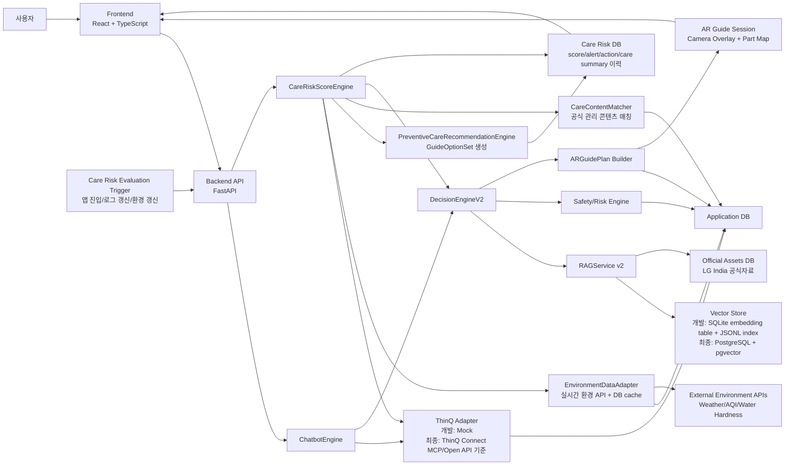
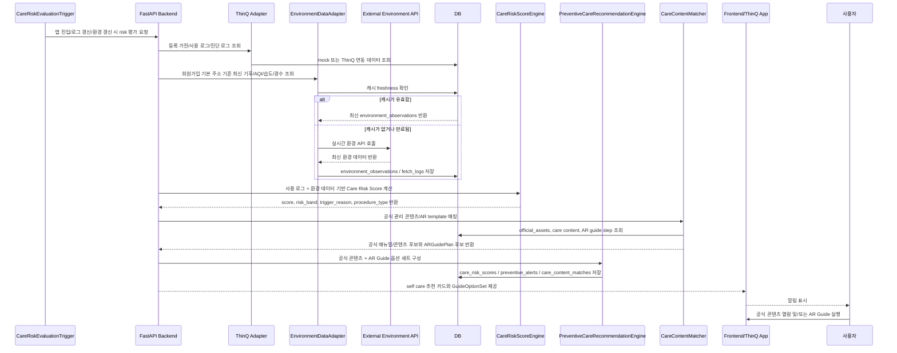
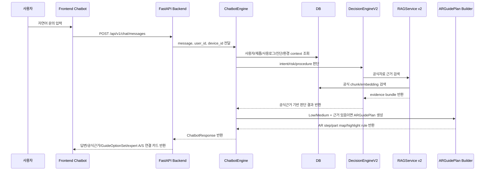
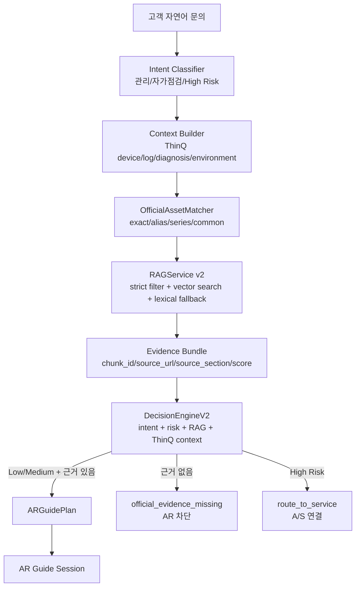
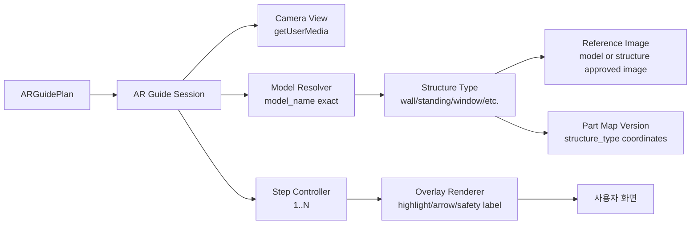

# CareShot AR Guide Engine 시스템 아키텍처

작성일: 2026-06-04

## 1. 아키텍처 목적

CareShot AR Guide Engine은 `self_care`, `self_as`, `expert_as` 세 가지 서비스 결과를 가진다.

첫 번째는 ThinQ 앱 내 챗봇을 통해 고객 문의, 등록 가전, 사용 로그, 스마트 진단, 인도 환경 context, LG India 공식자료 RAG 근거를 분석하고, 안전한 경우 `self_as`로 공식 콘텐츠와 AR Guide를 함께 제공하는 `사용자 문의형 흐름`이다. High Risk는 `expert_as`로 연결한다.

두 번째는 고객이 문의하기 전에 ThinQ 등록 가전 사용 로그와 회원가입 주소 기반 기후/환경 데이터를 결합해 `Care Risk Score`를 계산하고, 기준 점수 이상일 때 `self_care` 알림과 공식 콘텐츠, AR Guide를 함께 제공하는 `예방 알림형 흐름`이다.

용어 기준:

```text
self_care: 고장 전 예방 관리
self_as: 고객이 직접 가능한 자가 A/S
expert_as: High Risk 또는 공식 A/S 연결
```

최종 발표 시연은 에어컨 3개 구조 타입을 image-based AR overlay로 보여주는 방향으로 잡는다.

```text
wall_mounted_ac: 벽걸이형
standing_ac: 스탠드형
window_ac: 창문형
```

ThinQ 앱에 등록된 제품을 대상으로 하므로 고객 기기의 `model_name`은 ThinQ 등록 정보에서 exact value로 들어온다고 가정한다. 따라서 모델명이 다양해도 백엔드는 `model_name -> product_type -> structure_type -> reference_image/part_map/template` 순서로 매핑하면 된다.

개발 구조는 에어컨 3종만을 위한 하드코딩이 아니라 에어컨, 세탁기, 공기청정기, 정수기 전체 제품군과 다양한 모델을 대상으로 확장 가능하게 설계한다. 단, 최종 발표 시연의 화면 완성도는 에어컨 3개 구조 타입에 집중한다.

## 2. 전체 시스템 구조



### 2.1 서비스 진입 흐름은 두 갈래다

CareShot은 사용자가 문의했을 때만 동작하는 챗봇 서비스가 아니다. 최종 서비스는 아래 두 흐름을 모두 가져야 한다.

1. 예방 알림형 흐름
   - 고객이 직접 묻기 전에 백엔드가 사용 로그와 환경 데이터를 분석한다.
   - 예: 마지막 에어컨 필터 청소 90일 초과, 몬순 지역 고습도, AQI 악화, 세탁기 통세척 주기 초과, 정수기 경수 지역 사용.
   - 단순 rule 충족 여부가 아니라 `Care Risk Score`를 계산한다.
   - score가 기준 이상이면 ThinQ 앱 알림 또는 앱 내 카드로 예방 관리 필요성을 알려준다.
   - 사용자는 알림에서 공식 콘텐츠와 AR Guide를 함께 제공받고, 둘 다 자유롭게 사용할 수 있다.

2. 사용자 문의형 흐름
   - 고객이 챗봇에 자연어로 증상이나 관리 문의를 입력한다.
   - 백엔드는 문의를 관리/자가점검/High Risk로 분류한다.
   - 공식자료 RAG 근거와 안전 판단을 거쳐 공식 콘텐츠, AR Guide, 또는 A/S 연결로 분기한다.

### 2.2 예방 알림형 흐름



### 2.4 환경 데이터 연동 원칙

환경 데이터는 최종 개발 기준으로 외부 환경 API를 사용한다. 다만 매번 외부 API를 직접 호출하면 비용, 응답 지연, rate limit 문제가 생기므로 `실시간 API 연동 + DB 캐시` 구조로 설계한다.

```text
Frontend 또는 Backend care risk 평가 요청
-> EnvironmentDataAdapter
-> DB cache freshness 확인
-> 유효하면 DB의 environment_observations 사용
-> 만료되었거나 없으면 외부 환경 API 호출
-> 응답을 environment_observations와 environment_api_fetch_logs에 저장
-> CareRiskScoreEngine에 최신 환경 context 전달
```

개발 단계에서는 이미 수집한 `environment_contexts`를 사용하고, 최종 구조에서는 API key가 필요한 provider와 key가 필요 없는 provider를 `EnvironmentProvider` interface로 분리한다.

환경 데이터 입력값은 아래를 기준으로 한다.

```text
temperature
humidity
aqi
pm2_5
pm10
monsoon_or_rain_intensity
water_hardness_level
region
city
observed_at
provider
cache_ttl
```

### 2.5 Care Risk Score 산정 개념

예방 알림형은 단순히 “주기 실행으로 알림 생성”이 아니다. 사용 로그와 환경 데이터가 결합된 Care Risk Score가 기준 이상일 때만 예방 관리 알림을 만든다.

```text
Care Risk Score
= 사용 패턴 risk
+ 마지막 관리일 risk
+ 환경 risk
+ 제품군 민감도 risk
+ 스마트 진단 보정
```

예시 기준:

```text
0-39   알림 없음
40-59  낮은 우선순위 관리 팁
60-79  self care 알림 생성, 공식 콘텐츠와 AR Guide 함께 제공
80-100 높은 우선순위 self care 알림, 공식 콘텐츠와 AR Guide 함께 제공
```

AR은 자동 실행하지 않는다. 다만 공식 콘텐츠와 AR Guide는 모두 기본 제공되며, 사용자는 필요한 순서대로 열람/실행한다.

### 2.6 모델명 exact 매핑과 image-based AR overlay 원칙

CareShot AR은 현재 방향상 객체인식 AR이 아니라 `image-based AR overlay`다.

```text
ThinQ 등록 제품 model_name
-> product_models에서 exact model 조회
-> structure_type 확인
-> reference_images에서 해당 구조/모델의 이미지 선택
-> part_map_versions에서 좌표 버전 선택
-> ar_guide_steps와 ARGuidePlan 연결
-> 프론트에서 reference image 위에 overlay 표시
```

모델명이 다양해도 문제가 되지 않는 이유:

```text
1. ThinQ 등록 제품만 대상으로 하므로 model_name이 입력 단계에서 확보된다.
2. model_name exact match를 1순위로 사용한다.
3. exact reference image가 없으면 같은 structure_type의 approved generic reference를 사용한다.
4. structure_type도 없으면 AR Guide를 생성하지 않고 공식 매뉴얼/콘텐츠 또는 관리자 검토로 분기한다.
```

최종 발표 시연의 에어컨 구조 타입:

```text
wall_mounted_ac
- 전면 커버
- 필터
- 송풍구
- 전원 영역

standing_ac
- 전면 패널
- 프리필터/먼지필터
- 흡입구
- 토출구

window_ac
- 전면 그릴
- 필터 슬롯
- 배수/응축수 관련 외부 확인 영역
- 송풍구
```

전체 개발 구조의 대상 제품군:

```text
air_conditioner
washing_machine
air_purifier
water_purifier
```

다만 모든 제품군의 모든 모델별 reference image/part map을 당장 완성했다는 뜻은 아니다. 구현은 전체 제품군 확장 가능한 구조로 만들고, 발표 시연용 high-fidelity asset은 에어컨 3개 구조 타입에 우선 구축한다.

### 2.3 사용자 문의형 흐름



## 3. 기술 스택 결정

### 3.1 Frontend

| 항목 | 선택 | 이유 |
|---|---|---|
| Framework | React | 발표 시연 UI와 상태 흐름을 빠르게 구현하기 좋음 |
| Language | TypeScript | ChatbotResponse, ARGuidePlan, RAG evidence 타입 안정성 필요 |
| Build Tool | Vite | 빠른 개발 서버와 간단한 번들링 |
| Styling | Tailwind CSS 또는 CSS Modules | AR 화면과 챗봇 UI를 빠르게 구성 |
| Icons | lucide-react | 버튼/상태 아이콘 표준화 |
| Data Fetching | TanStack Query | `/chat/messages`, `/rag/search`, `/ar/sessions` 호출 상태 관리 |
| Local State | Zustand 또는 React Context | 현재 AR step, camera state, chat session 상태 관리 |
| Camera | Browser `getUserMedia` | 발표용 카메라/AR overlay 구현 |
| AR Overlay | HTML/CSS overlay + Canvas 보조 | image-based reference overlay와 part map 좌표 표시 |

현재 개발 화면은 정적 프론트 중심이지만, 최종 구조에서는 React + TypeScript + Vite로 전환한다.

### 3.2 Backend

| 항목 | 선택 | 이유 |
|---|---|---|
| Framework | FastAPI | Python AI/RAG 로직과 결합하기 쉽고 API 문서 자동 생성 가능 |
| Schema | Pydantic | 입출력 스키마 검증 |
| ORM/DB Access | SQLAlchemy 또는 SQLModel | SQLite/PostgreSQL 전환 가능 |
| Auth | 개발 단계 생략, 최종 OAuth/ThinQ 계정 연동 가정 | MVP와 발표 범위에서는 mock user |
| API Server | Uvicorn | FastAPI 표준 실행 |
| Logging | structlog 또는 Python logging | RAG 검색, safety audit, AR session 로그 |
| Background Job | 개발 단계 직접 실행, 최종 Celery/RQ 가능 | 공식자료 수집/embedding 재구축, 환경 API refresh, care risk 재평가 |

현재 백엔드는 FastAPI 구조로 전환되었다. 다음 백엔드 고도화 단계에서는 repository 계층, 최종 DB 전환, EnvironmentDataAdapter, CareRiskScoreEngine, PreventiveCareRecommendationEngine, ChatbotEngine을 분리 구현한다.

### 3.3 Database

| 단계 | DB | 역할 |
|---|---|---|
| 현재 개발 | SQLite | mock ThinQ, 공식자료, RAG chunk, embedding, AR session 저장 |
| 최종 개발 권장 | PostgreSQL | 서비스 운영용 관계형 DB |
| 최종 Vector DB 권장 | PostgreSQL + pgvector | 공식자료 chunk embedding 검색 |
| 대안 | Chroma 또는 FAISS | RAG 전용 vector index 분리 시 사용 |

SQLite는 개발과 발표 시연에는 계속 사용할 수 있다. 하지만 최종 산출물 설계에서는 PostgreSQL + pgvector를 기준으로 잡는 것이 맞다.

## 4. AI/RAG/AR 모듈 구조



## 5. RAG 구성

### 5.1 현재 구현 상태

| 구성 | 현재 상태 |
|---|---|
| 공식자료 asset | 791건 |
| 공식자료 chunk | 1,889건 |
| 공식 PDF chunk | Owner's Manual/Spec/Dimension 등 공식 PDF 기반 chunk |
| embedding table | `official_document_embeddings` 1,889건 |
| vector index 파일 | `vector_index/official_document_embeddings.jsonl` 1,889 line |
| RAGService v2 | 구현됨 |
| RAG v2 전체 파이프라인 | 아직 미완료 |

### 5.2 RAGService v2 검색 순서

```text
query
→ product_type / model_name / procedure_type / language strict filter
→ vector similarity search
→ 결과가 없으면 같은 strict filter 안에서 lexical fallback
→ 결과가 없으면 ar_guide_blocked=True
```

### 5.3 공식자료 허용 도메인

```text
https://www.lg.com/in/
https://gscs-manual.lge.com/
```

`gscs-manual.lge.com`은 LG Online Manual 원본 도메인이므로 공식자료 범위에 포함한다.

## 6. AR Guide 구조



현재 AR은 객체인식 AR이 아니라 image/reference 기반 AR Guide다. 발표 시연에서는 에어컨 3개 구조 타입인 벽걸이형, 스탠드형, 창문형을 구분해 image-based overlay로 보여주는 것을 목표로 한다.

## 7. API 구조

| Method | Endpoint | 역할 |
|---|---|---|
| `POST` | `/chat/messages` | 고객 문의 입력, 판단, RAG evidence, ARGuidePlan 반환 |
| `POST` | `/ai/analyze` | 판단엔진 단독 실행 |
| `POST` | `/rag/search` | 공식자료 RAG 검색 |
| `POST` | `/ar/guides/plan` | ARGuidePlan 생성 |
| `POST` | `/ar/sessions` | AR 세션 생성 |
| `GET` | `/ar/sessions/{id}` | AR 세션 조회 |
| `PATCH` | `/ar/sessions/{id}` | AR 진행 상태 업데이트 |
| `POST` | `/care/risk/evaluate` | 사용 로그/실시간 환경 데이터 기반 Care Risk Score 계산 |
| `GET` | `/guides/options` | 제품/절차 기준 Manual Guide + AR Guide 옵션 세트 조회 |
| `POST` | `/guides/{guide_id}/complete` | Guide 완료 이력을 `SELF_MANAGEMENT_HISTORY`에 저장 |
| `GET` | `/environment/current` | 사용자 지역 최신 환경 context 조회 |
| `POST` | `/environment/refresh` | 외부 환경 API를 호출해 cache 갱신 |
| `GET` | `/api/health` | 서버 상태 확인 |

FastAPI 전환 후에는 `/api/v1/...` prefix를 붙이고 OpenAPI 문서를 자동 생성한다.

## 8. DB 주요 테이블

| 테이블 | 역할 |
|---|---|
| `users` | 고객 프로필, 언어, 지역 |
| `devices` | ThinQ 등록 가전 mock |
| `usage_logs` | 가전 사용 로그 |
| `smart_diagnosis_results` | 스마트 진단 결과 |
| `environment_contexts` | 인도 지역 환경 context |
| `environment_providers` | 외부 환경 API provider 설정, API key 필요 여부, cache TTL |
| `environment_observations` | provider에서 가져온 최신/과거 환경 관측값 |
| `environment_api_fetch_logs` | 외부 환경 API 호출 이력, 성공/실패/rate limit |
| `care_risk_rules` | 제품군/환경/사용로그 기준 score 산정 rule |
| `care_risk_scores` | 사용자/기기별 Care Risk Score 계산 이력 |
| `preventive_alerts` | 사용자별 예방 관리 알림 생성 이력 |
| `preventive_alert_actions` | 사용자가 매뉴얼/AR/닫기를 선택한 이력 |
| `notification_logs` | 앱 알림 발송/표시/클릭 이력 |
| `care_content_matches` | 예방 알림과 공식 콘텐츠/AR Guide 매칭 결과 |
| `official_assets` | LG India 공식자료 asset |
| `official_document_chunks` | 공식자료 RAG chunk |
| `official_document_embeddings` | chunk embedding vector |
| `rag_search_logs` | RAG 검색 로그 |
| `safety_audit_logs` | 위험도 차단/검증 로그 |
| `chat_sessions` | 챗봇 세션 |
| `chat_messages` | 챗봇 메시지 |
| `conversation_state` | multi-turn 대화 상태 |
| `product_models` | 모델명과 structure type |
| `structure_types` | 제품군별 구조 타입 정의, 예: 벽걸이형/스탠드형/창문형 |
| `part_maps` | AR 부품 좌표 |
| `reference_images` | 모델/구조별 clean/open/annotated reference image |
| `part_map_versions` | reference image별 좌표 버전과 검수 상태 |
| `ar_guide_steps` | AR Guide step |
| `ar_session_logs` | AR 세션 진행 이력 |

## 9. 개발 단계와 최종 단계 구분

| 영역 | 현재 개발/시연 | 최종 개발 방향 |
|---|---|---|
| ThinQ | mock adapter | ThinQ Connect MCP/Open API/스마트 진단/사용 로그 연동 기준 |
| Backend | Python 기본 HTTP 서버 | FastAPI + Pydantic + SQLAlchemy |
| Frontend | 정적 HTML/JS 중심 | React + TypeScript + Vite |
| DB | SQLite | PostgreSQL |
| Vector DB | SQLite embedding table + JSONL index | PostgreSQL + pgvector |
| RAG | RAGService v2 구현 | RAG v2 전체 파이프라인 |
| AR | image-based reference overlay | image-based AR overlay 유지, 최종 시연은 에어컨 3개 구조 타입 |
| AI 판단 | rule 기반 1차 | DecisionEngineV2 + RAG + ThinQ context + safety |

## 10. 다음 개발 순서

현재 완료:

```text
RAG 데이터 구축
Embedding/Vector DB 구축
RAGService v2 구현
```

다음 작업:

```text
1. RAGService v2 검색 품질 검증 확대
2. official_assets strict matching + RAG 검색 결합 고도화
3. FastAPI 백엔드 구조 전환
4. PostgreSQL + pgvector 최종 DB 전환
5. React + TypeScript 프론트엔드 구조 전환
6. ChatbotEngine 구현
7. DecisionEngineV2 구현
8. intent/risk 평가셋 구축 및 정확도 검증
9. 에어컨 3개 구조 타입 AR Guide 화면 polish
```

## 11. 발표용 설명 문장

```text
CareShot AR Guide Engine은 ThinQ 등록 가전 정보, 사용 로그, 스마트 진단, 인도 환경 데이터를 분석하고, LG India 공식 매뉴얼/FAQ/Help Library를 RAG로 검색해 공식 근거가 있는 경우에만 AR Guide를 제공한다. 개발 단계에서는 SQLite embedding table과 JSONL vector index로 공식자료 chunk의 Vector DB 역할을 구현했으며, 최종 설계에서는 PostgreSQL + pgvector 기반으로 확장한다. AR은 객체인식이 아니라 image-based overlay 방식이며, ThinQ에서 들어온 model_name을 exact 기준으로 structure_type, reference image, part map에 매핑한다. 발표 시연은 에어컨 벽걸이형, 스탠드형, 창문형 3개 구조 타입을 대표 사례로 구현한다.
```
